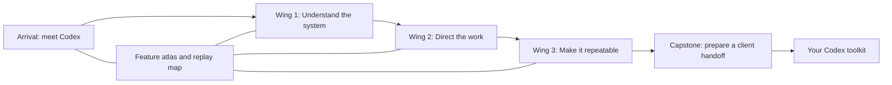

# Inside Codex — production and community-release plan

Status: production authorized and in progress. September 9, 2026, Toronto time. Research checked September 10 UTC. See production/EXECUTION-CONTRACT.md for Mark's execution instruction and the scope of autonomous work. Release gates remain unmet.

## 1. The experience we are making

A premium, browser-playable 3D tour of the Codex ecosystem, led by a personified Codex logo. The player learns to direct useful work: give context, choose an appropriate model and effort, organize tasks, connect tools, review evidence, and turn a successful workflow into something repeatable.

The creative premise is **step inside the system you are learning to operate**. Codex is a character with presence and timing. Its headquarters is a coherent physical place. The environment responds to the player's decisions, making otherwise invisible concepts visible.

Working title: **Inside Codex**. Public attribution: a community learning experience by Mark Kashef. Final naming and visual treatment remain open until the visual target is approved.

The value proposition is concrete: leave with a reusable task brief, a context checklist, a model-selection decision guide, a review checklist, and a starter workflow that can be used in the real app. We will measure whether players can apply those habits. We will not assert unmeasured revenue or time savings.

### Audience and session design

- Primary audience: Mark's community, including business owners and capable beginners who know conversational AI but underuse Codex.
- Guided tour: approximately 25–35 minutes, divided into three resumable chapters. The first useful action happens within 60 seconds after entering the loaded experience.
- Quick route: a 7–10 minute introduction with three essential missions and direct access to the take-home toolkit.
- Explorer route: revisit completed exhibits, inspect advanced details, and use a searchable feature atlas.
- Each mission lasts approximately 90–150 seconds. Reading and exploration are optional beyond the essential interaction.
- No account or API key is required to play the initial release. Progress is saved on the current device, with an explicit export/import option.

The initial release is complete at its promised scope: twelve core missions, three chapters, one capstone, a feature atlas, and useful downloadable resources. Additional ecosystem topics can be added without rebuilding the world.

## 2. Highest fidelity: the visual contract

The target is a carefully art-directed interactive experience with the finish of a premium animated product film: convincing materials, generous composition, expressive character animation, restrained effects, excellent sound, and smooth interaction. The browser's actual rendered output is the delivery standard.

Before producing all rooms, create a **visual target package** containing the arrival shot, mascot close-up, one learning exhibit, a material sheet, and a 15–20 second motion sample. Review at actual gameplay scale. Lock one direction and record what makes it successful so subsequent assets remain consistent.

### Codex mascot

The existing blue-violet, scalloped Codex logo reference with its white `>_` mark is the starting reference. It is already present at `../astra-best-results/site/public/assets/codex.png`. Verify its upstream provenance and current appearance before art lock; preserve an unchanged source copy and checksum.

Build the logo itself as the character's core:

1. Derive clean vector contours from the authoritative source; compare a front render with the original silhouette and glyph placement.
2. Model a sculptural version in Blender, with controlled thickness, clean bevels, and a polished blue-violet surface. Preserve the recognizable outline and white glyph.
3. Develop two tightly bounded material studies: pearlescent enamel and restrained translucent resin. Select the treatment that remains legible under gameplay lighting.
4. Convey attention through facing, tilting, pointing, and small expressive hands. Keep the glyph readable during normal poses. Accessories must support silhouette and character performance.
5. Create a master mesh, clean deformation topology where needed, a small rig, contact/shadow behavior, and game-ready detail levels.
6. Animate idle, greeting, beckoning, pointing, inspecting, thinking, successful confirmation, gentle correction, moving ahead, waiting, and returning to the player.
7. Blend states with anticipation and settle. The guide looks toward its destination before moving and gives the player room to see and act.

The mascot must be recognizable in a small silhouette, compelling in close-up, and readable against every room. Test both side profiles, back view, fast turns, and all animation transitions. Personality should feel observant and helpful; dialogue should be concise and specific.

### Architecture and lighting

Use one architectural language across a central atrium and three wings: pale mineral surfaces, brushed metal details, deep charcoal interaction areas, and blue-violet energy associated with Codex. Warm practical lights and a small amount of greenery keep the space inviting. Distinct lighting and spatial forms identify the wings without changing the design language.

Create a deliberate hierarchy: mascot first, active exhibit second, orientation landmarks third. Quiet background regions keep text and important silhouettes legible. Reserve the arrival sightline for the mascot and the first interactive object.

Model structural walls with thickness, actual door openings, intentional circulation, plausible fixtures, and visible support. Every door has a destination; every alcove has depth. Build floors, walls, ceilings, exhibit plinths, seating, and signs from a restrained modular kit. Add a small number of bespoke hero exhibits.

Use baked indirect lighting for architectural richness, environment reflections, selective real-time key lights and shadows for the mascot, ambient occlusion, restrained bloom, and consistent tone mapping. Inspect lightmap seams, contact shadows, reflective surfaces, and bright glyph edges in runtime. Avoid heavy depth of field during interaction. Use it only in brief optional shots if readability survives.

### Camera and movement

Default to a guided camera with controllable local exploration: the guide escorts players between exhibits, while the player can look around and approach relevant objects. Offer click-to-move/waypoints and keyboard movement, with a touch-friendly alternative. Inspect traversal in real 3D, including the spaces between hero shots.

Use approximately 50–60 degrees vertical field of view initially, then tune against real playtesting. No required head bob, camera shake, sprinting, or precision platforming. Escape releases camera capture. A visible map and “Return to guide” prevent wandering from becoming a blocker. Reduced-motion mode uses stationary compositions and short transitions.

## 3. World structure and learning missions

The player is preparing a small business workflow for handoff: turn a messy client brief and sample data into a useful onboarding workspace. Each wing improves a different part of that outcome. All examples use fictional data supplied with the game.



| Mission | What the player does | What becomes understandable | Real-world takeaway |
| --- | --- | --- | --- |
| 1. The control room | Assemble a model, relevant context, a tool, and a verification step into a working system | The model and the surrounding harness perform different jobs; tool results feed subsequent actions | A practical diagram of the agent loop |
| 2. The context archive | Select the brief, sample file, project instructions, and relevant screenshot; remove a stale source | Useful context, file access, task history, and persistent guidance have different roles | A context checklist and brief template |
| 3. The model observatory | Route several tasks to model/effort combinations and inspect the resulting evidence | Capability, speed, effort, available tools, and usage are separate considerations | A decision guide grounded in current available models |
| 4. The permission desk | Diagnose a failed action and choose the missing scoped permission or connection | Technical access, user authorization, and sandbox/approval settings are distinct | A permission troubleshooting checklist |
| 5. The task studio | Create a focused simulated task with an explicit outcome and effort, name it, and pin it | The app can help organize work; pinning changes visibility, not context | A copyable create-and-pin request |
| 6. The branch workshop | Separate two changes, compare a conversation fork with a Git worktree, and reunite the useful result | Conversation history and files are separate; parallel work needs isolation and ownership | A fork/worktree choice guide |
| 7. The steering station | Correct a running job at the useful moment and queue a separate next step | Steering changes the active objective; queued work waits; a status question need not cancel work | Short examples of steer, queue, and status requests |
| 8. The review bench | Inspect a plausible-looking output, identify a bad diff or wrong field, run a meaningful check, and request repair | A completed response is evidence to inspect; attractive output can still be wrong | An acceptance-test and review checklist |
| 9. The tool workshop | Connect a fictional source through a plugin, inspect its scope, and select a reusable skill | Plugins, tools/connectors, skills, and instructions have different functions | A tool-selection and setup guide |
| 10. The browser lab | Compare a page's actual interaction with a screenshot and reproduce a visual bug | Browser state, network results, screenshots, and real interaction provide different evidence | A practical “test this in the browser” request |
| 11. The automation tower | Convert a working task into a scheduled job with clear inputs and failure behavior | A tested workflow can recur; local work depends on the host and available access | A reusable scheduling brief |
| 12. The handoff dock | Package the result, run acceptance checks, recover a deliberately bad change, and prepare a release | Artifacts, verification, persistence, and deployment complete the work | A real handoff checklist and starter package |

### Capstone and useful rewards

The player receives an unfamiliar but comparable onboarding brief, chooses context, proposes a task structure, sets effort appropriately, selects tools, reviews a seeded defect, and defines a recurring follow-up. The environment only reaches its finished state when the decisions produce an acceptable handoff.

Score five dimensions: brief clarity, context relevance, task/tool choice, verification quality, and repeatability. Use explanatory feedback and permit retries. Reward reasoning and recovery rather than clicking every item or always selecting maximum effort.

The final toolkit contains the player's chosen workflow, reusable prompts, an editable AGENTS.md starter, a skill outline, a review checklist, and sources. Files are readable without the game. The learning tracker distinguishes completed missions, hint-assisted completion, and an independent capstone attempt.

### Feature atlas: broader ecosystem coverage

The atlas covers app navigation and shortcuts; tasks and projects; models/effort and usage; context and instruction scope; skills/plugins/MCP; files and generated artifacts; browser and computer use; review and Git; worktrees, forks, and delegation; local/remote/cloud distinctions; scheduled tasks and long-running work; configuration and troubleshooting; CLI/IDE entry points; and optional developer topics such as SDK/app-server integrations and hooks.

Every entry has a short explanation, a concrete use case, a source, supported surface, and verification date. Topics beyond the twelve missions begin as inspectable exhibits and practical references. They become full missions only when they add a distinct learning outcome.

## 4. The interaction loop

Each mission follows a consistent rhythm:

1. Show a useful goal and a visible problem in the environment.
2. Let Codex demonstrate one small action, then return control.
3. Ask the player to make a consequential choice or manipulate a working example.
4. Show the result spatially and in a concise UI panel.
5. Explain the causal link, including why a plausible wrong choice failed.
6. Offer retry, a graduated hint, and “Use this in Codex.”

Tutorial hints escalate from directing attention, to explaining the relevant concept, to offering a worked example. Avoid dead ends, punishment timers, forced repetition, and progress dependent on precise motor skill. Provide alternate accessible UI controls for spatial interactions.

Dialogue never blocks an action the player already understands. Captioned voice can be skipped or replayed; important instructions remain available. Once a mission is complete, fast travel and direct replay reduce travel time.

## 5. Accurate teaching and honest simulations

The first release uses deterministic simulations. A public webpage does not acquire the player's local Codex task-management tools. “Create a task and pin it” operates on the game's simulated workspace, then provides an accurate prompt to use in the real app. Label that boundary when it matters to the learner.

Build a versioned capability catalog. Each lesson stores its source URLs, verification date, applicable product surface, prerequisites, claim type, and a real reproduction procedure. Claim types are: official documentation, observed behavior on Mark's installation, and illustrative simulation. The game should not present a capability seen in one installation as universally available.

Current docs describe model/effort choice and its time/token tradeoff, project/task organization, scoped AGENTS.md discovery, worktree isolation, skills, and scheduled local tasks. The curriculum will retain those distinctions. Model cards are editable content; lessons must not encode permanent numeric rankings or invented speed/cost measurements. If scenario meters are illustrative, label them as such. Recheck model availability before release. [Models](https://learn.chatgpt.com/docs/models), [Projects and chats](https://learn.chatgpt.com/docs/projects), [AGENTS.md](https://learn.chatgpt.com/docs/agent-configuration/agents-md), [Worktrees](https://learn.chatgpt.com/docs/environments/git-worktrees), [Skills](https://learn.chatgpt.com/use-cases/reusable-codex-skills), [Scheduled tasks](https://learn.chatgpt.com/docs/automations).

The model/harness exhibit visualizes requests, tool calls, results, and checks. It does not invent a view into hidden reasoning. Real task-management tricks are verified in disposable examples during production, with applicable app version recorded.

Optional future live-agent mode would be a separate integration with explicit user access and a bounded service budget. It is unnecessary for the first learning experience and is outside this release's runtime architecture.

## 6. Technical architecture

Use the working Blender-to-Babylon.js pipeline established by the smoke test. Build a standalone Vite/TypeScript application with modular Babylon.js imports and a semantic DOM interface. A small UI component layer can manage menus, dialogue, inventory, map, and reference cards; the rendering and learning-state layers remain independent.

- **Rendering:** WebGL2 is the initial delivery baseline because the local import path is tested. Add WebGPU only after visual parity and compatibility evidence justify another renderer path.
- **World:** authored room manifests, scene streaming, collision/navigation geometry, trigger volumes, camera waypoints, and interactable entity IDs.
- **Mascot:** animation state machine coordinated with navigation and dialogue; deterministic timestamps available to tests.
- **Learning:** typed lesson definitions, validators, hint rules, prerequisites, and completion events, independent of mesh names or frame rate.
- **Progress:** versioned IndexedDB/local storage, migration tests, explicit reset, JSON export/import, and resilient behavior when storage is blocked.
- **Audio:** dialogue, music, ambience, and effects on separate buses; captions, independent sliders, immediate mute, and user-gesture startup.
- **Diagnostics:** development-only state inspection, fixed seeds, camera presets, asset-readiness flags, and event traces. Hide debug controls in release builds.
- **Delivery:** a static `dist/` output containing the game and needed runtime assets. No provider keys, local sources, or .blend files enter the published directory.

Suggested project layout:

```text
game/
  src/rendering/       cameras, lights, asset loading, quality settings
  src/world/           rooms, navigation, collision, interactions
  src/mascot/          rig bindings and animation/dialogue coordination
  src/learning/        lesson state, scoring, hints, prerequisites
  src/ui/              accessible menus, captions, atlas, resources
  src/persistence/     saves, migration, export/import
  content/             lessons, model catalog, dialogue, source ledger
  public/assets/       approved runtime geometry, textures, audio, fonts
  tests/               meaningful state, browser, recovery, and release tests
  tools/               asset validation, deterministic capture, release checks
art-source/            Blender masters, material and animation source
production/            layout manifests, target images, review decisions
evidence/              immutable captures, checks, measurements, defect register
releases/              reproducible distribution archives and manifests
```

Reuse test learnings from `smoke-test/` while keeping the diagnostic fixture intact. Create the production repository in this game's own directory and isolate its dependencies from the parent YouTube workspace.

## 7. Asset production from source to runtime

1. Inventory each asset by function, scale, support surface, semantic front, reuse class, texture requirements, detail levels, and rejection criteria.
2. Draw the floor plan, opening schedule, key sightlines, and camera paths. Validate navigation and interaction clearances with simple geometry.
3. Build the mascot and one exhibit at finished quality. Use that scene to settle material response and rendering costs.
4. Author high-detail Blender masters. Produce deliberate runtime topology, UVs, normals, and simplified collision geometry. Bake details where they improve appearance without adding unnecessary geometry.
5. Produce material maps with correct color spaces, packed channels where suitable, clean lightmap UVs, and controlled texel density. Test glyph readability after compression.
6. Export GLB with tested materials and animations. Use mesh compression and KTX2 only after a representative asset passes import and visual comparison. Host any required decoders with the application. Babylon supports GPU-compressed KTX2 textures; compression format and settings still require asset-specific inspection. [Babylon texture documentation](https://github.com/BabylonJS/Documentation/blob/master/content/features/featuresDeepDive/materials/using/ktx2Compression.md).
7. Inspect with Game Development Studio, validate against the project's policy, build a canonical package, verify hashes, and import the exact verified bytes.
8. Inspect the asset in the production camera under both neutral and room lighting. A Blender render alone never approves runtime appearance.

Prefer authored Blender geometry for the mascot, architecture, and precise exhibit mechanisms. Generated reference images can support art direction. Meshy/Tripo/Leonardo remain optional for specific secondary assets, subject to credentials, a declared budget, and a clear rejection rule. No paid generation budget is assumed. Keep provider task IDs, prompts, source references, licenses, and receipts outside the runtime package.

## 8. Initial budgets and device coverage

These are proposed acceptance targets to validate with the first finished room. They are not measurements of the future game. If a target proves incompatible with the approved appearance, document the tradeoff before changing it.

| Budget | Desktop high quality | Mobile/balanced quality |
| --- | --- | --- |
| Mascot geometry | Approximately 40–80k visible triangles for close shots | Approximately 12–25k, same recognizable silhouette |
| Visible scene | Target at most 700k triangles and 180 draw calls | Target at most 250k triangles and 100 draw calls |
| Texture source/runtime | 4K source for hero assets; mostly 2K runtime, selective 4K | Mostly 1K/2K with inspected compression |
| Texture residency estimate | Target at most 384 MB for active room set | Target at most 160 MB |
| Stable traversal | Median frame interval at most 16.7 ms; p95 at most 22 ms | Median at most 33.3 ms; p95 at most 40 ms |
| Visible stutters | No repeatable interaction stalls above 100 ms after warmup | Same, with room loading explicitly separated |
| First-play download | Target at most 12 MB before first interaction | Target at most 8 MB |
| Complete release assets | Target at most 120 MB, loaded progressively | Smaller texture/geometry tier |

Display the title and loading feedback promptly. Target an interactive first exhibit within six seconds under a declared 25 Mbps/50 ms test profile with cold cache; measure network transfer, decoding, and shader preparation separately. Higher quality assets can load before entering the next wing. Never silently download the entire experience at startup.

Provide quality choices and an automatic recommendation based on measured frame stability. Lower resolution/effect cost before compromising instructional clarity. Keep the mascot recognizable in every tier. GPU-memory figures are estimates unless reliable platform instrumentation is available.

Test layouts at 1920×1080, 1440×900, 1280×720, 1024×768, 390×844, and a compact landscape phone viewport. Desktop testing covers Codex's in-app browser and available Chrome, Firefox, and WebKit runtimes. Real iOS Safari and Android Chrome checks are tracked separately; desktop device emulation does not prove real-phone behavior.

## 9. Audio, interface, and accessibility

Write a complete dialogue script after mission interactions are established. The guide explains the consequence the player just caused. Use a warm, concise voice with deliberate pauses. Produce voice in short replaceable lines; retain text, pronunciation notes, timing, and source. Select the actual recording/TTS route and budget before rendering final audio.

Compose or source a small cohesive score, wing ambience, movement cues, and distinct interaction/confirmation/error sounds. Keep voice intelligible over ambience; inspect transitions, loop seams, clipped peaks, and headphone playback. Caption every instructional line. The whole experience remains usable muted.

Menus and lesson text live in accessible DOM controls. Requirements include visible keyboard focus, meaningful labels, logical focus order, keyboard alternatives for dragging, text enlargement, adequate contrast, no color-only feedback, large touch targets, a reduced-motion option, and no camera trap. Test navigation and instruction reading with assistive technology where available. A guided text/card route must preserve the lessons when 3D is unavailable.

The UI shows one primary objective at a time, contextual controls, a pause menu, progress, atlas, sound settings, quality settings, and save/export options. Put technical provenance in the atlas rather than on every gameplay surface.

## 10. How I will test in the internal browser

There are two complementary workflows: automated browser checks for repeatability, and actual interactive inspection in Codex's browser for the delivered experience. Both use the same built application and asset manifest.

### Repeatable browser tests

For every mission, exercise entry, the normal solution, each meaningful failure branch, hints, retry, completion, exit, and replay. Test changing missions mid-dialogue, double-clicks, rapid inputs, resize/orientation change, tab backgrounding, refresh, and resume. Verify completion from meaningful actions rather than merely advancing dialogue.

Test the full first-time journey and a returning-player journey. Include corrupted/old saves, disabled storage, missing assets, slow networks, aborted downloads, decoder failures, graphics-context loss, and unsupported graphics. Every recoverable failure needs a usable recovery control and must preserve earned progress where possible.

Read the scene-ready signals before capture: room geometry, textures, environment, lights, animation, fonts, and interactions must report ready. Freeze seed, camera, simulation time, renderer, viewport, and quality tier for deterministic regression shots.

Record console errors, failed requests, render-state errors, stuck mission states, and accessible UI state. Browser tests inspect real rendered pixels and interactions alongside lesson-state assertions. Do not let a test-only shortcut be the only way to complete a mission.

### My interactive assessment in Codex

I will open the actual build in the internal browser, begin with a clean save, and play the whole tour through its visible controls. I will then revisit it as a returning player, deliberately make wrong choices, interrupt the guide, skip dialogue, use hints, change quality, resize the viewport, and return after a reload.

For each exhibit I will inspect:

- Arrival: is the intended next action apparent, and does the mascot lead attention to it?
- Action: are controls responsive, readable, and physically unambiguous?
- Consequence: can a player see what changed and why?
- Camera: does the mascot, UI, or architecture obstruct the learning object?
- Recovery: can a confused player return to a useful state?
- Finish: does the player receive a practical takeaway and a clear route onward?

Review the mascot at rest, in motion, pointing, correcting, and waiting. Review environment first/middle/final states and the spaces between camera landmarks. Inspect floors, ceilings, reverse views, door thresholds, reflections, silhouettes, and close-up materials. Save exact screenshots and repro steps for defects; fix them and rerun the affected checks.

### Visual and performance evidence

Use fixed arrival, mascot close-up, active interaction, reverse room, ceiling, and transition shots for each room. The room-production helper adds its multi-angle shell and mounting checks. Add color/depth/object-ID diagnostics when a rendering defect needs localization.

Seal comparable capture bundles with build ID, asset hashes, scene seed, camera, quality, resolution, browser version, and device. Record cold-load measurements, a repeatable 90-second traversal after warmup, and a 30-minute soak. Use at least three comparable traversal runs for performance review. Interpret frame timing as browser observation unless corroborated by native GPU instrumentation.

Performance fixes must preserve the approved visual target and mission correctness. Do not improve metrics by hiding objects, reducing the workload, or lowering the declared tier without disclosing the change.

## 11. How I will assess quality beyond passing tests

Use a scorecard with concrete evidence, reviewed against the approved visual target. This is an assistant assessment, not independent human approval.

| Dimension | Weight | Evidence required |
| --- | --- | --- |
| Mascot identity and character performance | 20 | Logo comparison, close-up, motion/transition review |
| Environment, composition, materials, lighting | 20 | Runtime multi-angle review in each room |
| Teaching clarity and practical transfer | 25 | Goal/action/consequence review plus independent capstone behavior |
| Interaction feel, camera, and navigation | 15 | Complete manual playthrough and recovery attempts |
| UI, accessibility, and audio | 10 | Keyboard/muted/reduced-motion routes and relevant audits |
| Performance and technical robustness | 10 | Declared-device load, traversal, soak, and failure evidence |

Proposed internal release threshold: at least 90/100 overall, no dimension below 8/10 on its normalized scale, and every mandatory technical gate passing. Record a reason and screenshot/test receipt for each score. Repeated self-scoring is not a substitute for fixing specific defects.

For credible learning validation, recommend a small preview with Mark and 5–8 representative community members. Observe whether they can begin without coaching, complete the three essential skills, and solve the capstone without a worked example. Use short teach-back questions and an equivalent pre/post task. An initial pilot target is at least 80% completing the core route unaided and a median improvement of at least 20 percentage points on the task rubric; report the raw small-sample results rather than claiming statistical certainty.

I can prepare the pilot instructions and feedback form. No community messages are sent without Mark's instruction. If a human/device check cannot be run, label it unverified and narrow the release claim instead of declaring universal readiness.

## 12. Release gates and defect rules

| Gate | Required result |
| --- | --- |
| A. Direction | Mascot source, appearance target, layout, camera, core learning promise, scope and budgets recorded |
| B. Finished sample | One complete mission with final-quality mascot, room, audio/UI, practical takeaway, and measured runtime |
| C. Complete experience | All twelve missions, capstone, atlas, resources, saves, hints, replay, and accessibility route integrated |
| D. Technical acceptance | Production build and relevant state, browser, asset, recovery, compatibility and performance checks pass |
| E. Experience acceptance | Internal scorecard and complete interactive review pass; human feedback and unavailable-device limits recorded |
| F. Hosted acceptance | The exact here.now release loads from a clean session, completes the tour, restores progress, and serves all assets correctly |
| G. Community handoff | Final URL, release notes, known limits, sources/date, support instructions, and reproducible rollback package ready |

Stop release for crashes, blocked progression, lost progress, false teaching claims, missing core assets, exposed credentials, illegible instructions, pervasive clipping/occlusion, broken keyboard/touch navigation, or failure on a declared supported device. Major visual problems in a hero shot also block release even when code tests pass.

Track defects by severity, affected build, reproduction, evidence, fix, and verification. Minor imperfections may be accepted only with a recorded rationale; they must not silently disappear from the report. “Perfect” is not a falsifiable engineering claim. Our release claim will specify the verified experience, devices, gates, and known limits.

The room plugin explicitly calls for “Record explicit human Form approval” and “Record explicit human Runtime approval.” Its default workflow has human gates before final export/deployment; Mark’s subsequent execute-and-iterate instruction authorizes the local production and eventual release work described in production/EXECUTION-CONTRACT.md. See [Build 3D Game Rooms SKILL.md](/Users/markkashef/.codex/plugins/cache/openai-curated-remote/build-3d-game-rooms/0.3.3/skills/build-3d-game-rooms/SKILL.md). The execution contract records the selected direction and scope of autonomous preview/export/release work. Do not invent human sign-off from automated checks. Production is proceeding under that instruction; assistant review is not represented as human artistic approval.

## 13. here.now hosting and verification

The here.now skill v1.28.0 is installed. Email-code authentication for Mark succeeded, the credential was stored privately with mode 0600, and an authenticated account read passed. No site was published during planning.

Use an authenticated, permanent site for distribution. Upload only the production `dist/` directory, using the installed helper with Codex attribution and SPA mode if path routing needs it. Check the returned ownership, live status, and persistence before announcing the URL. here.now records versions; built-in history preview/restore depends on plan, so retain local release archives regardless. [here.now documentation](https://here.now/docs).

Before the first publish, inspect account quota and current site state. Establish a dedicated preview/release workflow for this game; do not overwrite an unrelated site. Preserve source/build/asset hashes and deployment receipts. Verify content types, nested routes, GLB/texture/audio decoding, cache behavior, and all download links at the actual hosted URL.

Repeat a fresh-session tour in Codex's internal browser against the hosted build, then repeat the relevant automated release checks there. Reopen it signed out to confirm the intended community access. A successful upload is not a successful release.

Retain the previous distribution archive. If native rollback is unavailable, republish its verified contents through the normal update flow, checking for concurrent changes first. A trial rollback belongs on a dedicated preview site. Community announcements remain a separate requested action.

## 14. Production order and unattended work

| Stage | Deliverables | Dependency |
| --- | --- | --- |
| 0. Foundation | Smoke evidence, here.now auth, project/source structure, capability ledger | Smoke and auth complete |
| 1. Direction lock | Logo source, visual target, layout, interaction storyboard, quality/budget contract | Review this plan |
| 2. Finished sample | Arrival, final mascot, one mission, save/resume, browser assessment | Direction settled |
| 3. Content-complete build | All missions, capstone, atlas, useful toolkit | Sample meets the quality bar |
| 4. Polish and resilience | Animation/audio/lighting refinement, accessibility, recovery, performance | Content stable |
| 5. Release candidate | Evidence packet, hosted preview, user/device feedback | Gates D and E assessed |
| 6. Community release | Hosted acceptance, final URL, resources, rollback archive | Release gates satisfied |

An overnight run should work through this dependency chain, keeping a runnable checkpoint after each completed stage. Prioritize the mascot and one finished mission first; they establish the quality bar for everything else. Continue into the remaining content when those conditions are met. Save the exact remaining work if usage, a human gate, or a service problem prevents completion.

At each checkpoint, record what exists, what was tested, unresolved defects, and the next executable step. Retry a transient build failure only after identifying a plausible cause. Preserve previous working builds and renders. Never spend the entire unattended window repeatedly polishing a single asset while the required experience remains incomplete.

We can automate implementation, builds, asset exports, rendering, browser playthroughs, diagnostics, and report creation within the agreed scope. We cannot promise a complete high-fidelity game will be perfect after one night, or treat this powerful Mac as proof of performance on community devices.

### Before the unattended run

- Settle the visual target and final production scope, including the room plugin's human-gate handling described above.
- Resolve usage headroom. The last smoke-test check showed 5% weekly allowance remaining and one unused full reset; recheck at launch. No reset is authorized by this plan.
- Keep the Mac powered, awake, connected, and the app running while local work executes.
- Set any optional generation/voice budget and credential route. The default third-party generation spend is zero until specified.
- Confirm the intended community access at release. Default proposal: anyone with the URL, with local progress and no player sign-in.

here.now authentication is complete, so email login is no longer an outstanding prerequisite.

## 15. Maintenance and handoff

Deliver source, Blender masters, asset provenance, a reproducible build, lesson/source catalog, browser and visual evidence, a defect register, distribution archive, and the final hosted URL. Include a short support guide covering graphics settings, progress export, stuck-state recovery, and browser compatibility.

Date every capability card. Before each content release, recheck changed OpenAI features and model availability, rerun affected mission checks, and run the full release path once. Publish a small changelog and increment the content/save schema deliberately. Schedule recurring documentation review only if requested; no recurring automation is created by this plan.

Success is a game people want to finish, a guide they remember, and habits they can use immediately in Codex. Evidence of learning and actual community use will determine whether the game earns further expansion.
