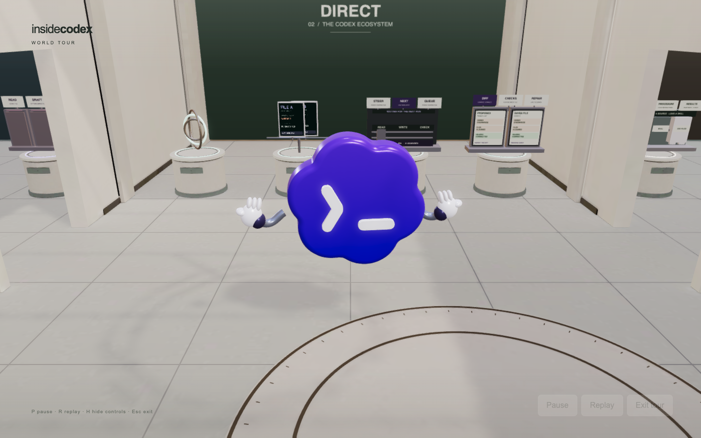
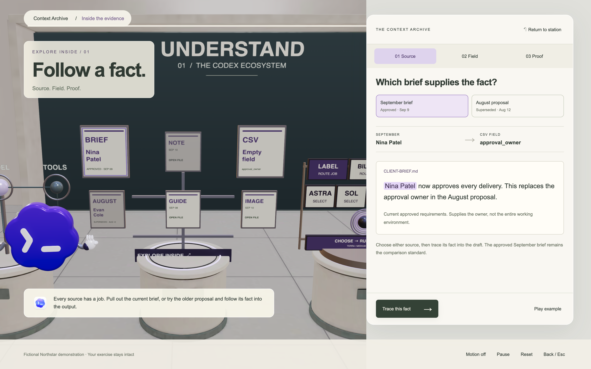
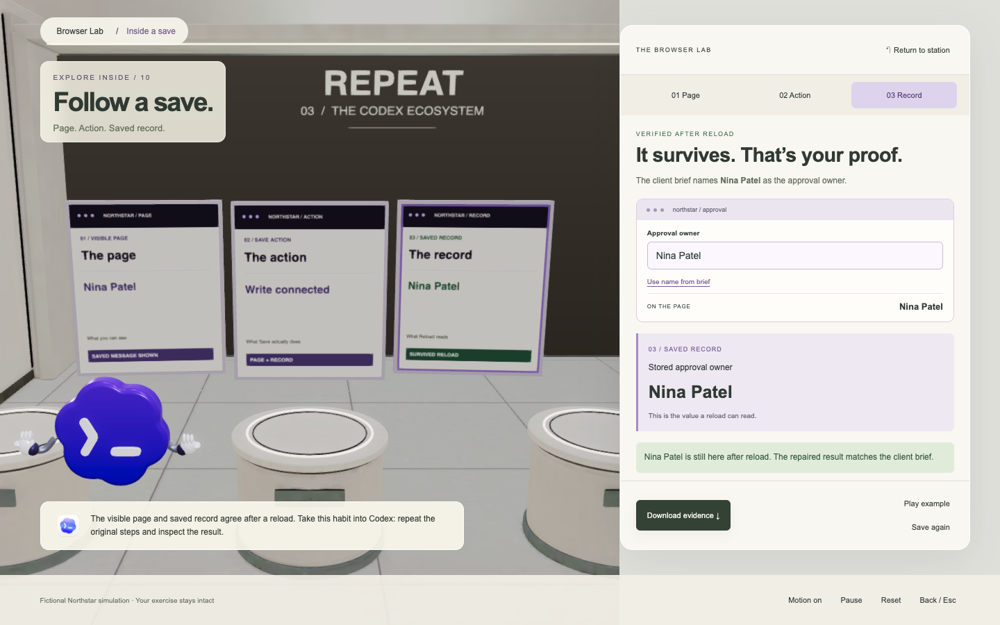
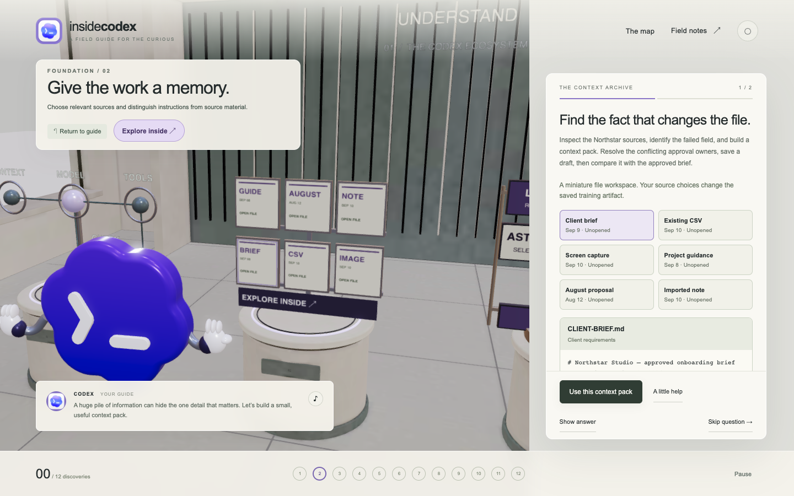
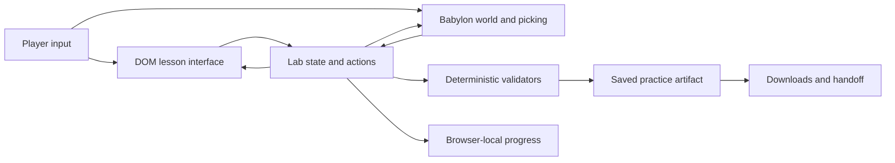
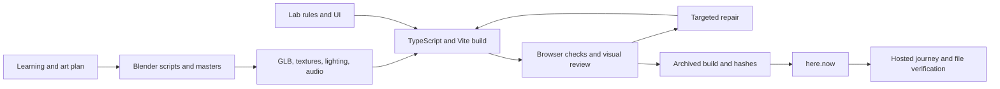

<div align="center">

# Inside Codex

### A world you can play. A workflow you can take home.

A 3D field guide to working with Codex, built by **Mark Kashef with Codex** for **Early AI Adopters**.

[Play the game](https://wintry-soul-6awh.here.now/) · [Run it locally](#run-it-locally) · [How we built it](#how-we-built-it) · [Architecture](#architecture) · [Extend the game](#extend-the-game) · [Test it](#test-it) · [Troubleshooting](#troubleshooting)

**12 missions · 3 wings · 17 lesson questions · 50 field notes · 2 optional deep dives · 1 independent capstone**

</div>



## Why this exists

The starting question was simple: if an agent can build a game, can the game teach something worth learning?

Mark wanted to turn the game-building trend into an experience with practical value. The player should leave knowing how to give an agent context, choose a model, set boundaries, steer work, check an artifact, and hand the result to someone else. A personified Codex logo would guide them through the ecosystem.

That became a physical gallery of working exhibits. A source document changes a CSV field. Two checkouts can collide. A browser form can look finished while failing to save. An automation needs a tested procedure before a schedule. Each mechanism gives the player a visible consequence to inspect.

The game runs as a static website. Its exercises use fictional data and deterministic rules: **no player API key, Codex account connection, or live model call is required**. The educational value comes from the quality of the situations and feedback. Actual learning gains, sustained usage, and economic value still need audience evidence.

## What you can do

| Wing | Station | What the player practices |
| --- | --- | --- |
| **Understand** | 01 · Control room | Distinguish the model, tools, context, and agent loop. |
| | 02 · Context archive | Inspect sources, resolve conflicting facts, build a context pack, and verify a saved CSV. |
| | 03 · Model observatory | Match the job to a model and reasoning effort; inspect the result. |
| | 04 · Permission desk | Understand the scope of an action and the boundary of its authorization. |
| **Direct** | 05 · Task studio | Turn an intention into a concrete task with a checkable outcome. |
| | 06 · Branch workshop | Distinguish conversation forks, shared checkouts, and isolated worktrees. |
| | 07 · Steering station | See how instructions arriving before, during, or after work affect the result. |
| | 08 · Review bench | Read findings, repair deliberately, and check the changed artifact. |
| **Repeat** | 09 · Tool workshop | Connect access, tools, skills, and reusable procedures. |
| | 10 · Browser lab | Test actual interaction and persistence, beyond a screenshot. |
| | 11 · Automation tower | Rehearse a useful procedure before scheduling it. |
| | 12 · Handoff dock | Package a result with the evidence and context needed to continue. |

An independent **Cedar reporting capstone** tests transfer to a new scenario. It records first-submission evidence and assistance separately. The field notes and toolkit provide dated sources, requests to try in real work, and editable practice files.

There are also three ways to explore:

- **Walkthrough:** progress through the exercises, reveal an answer when helpful, or skip a question. Skipping does not award completion.
- **World Tour:** a silent 44-second camera route through all three wings, including an atrium orbit, designed for a narrated preview.
- **Explore inside:** the Context Archive unfolds into Source → Field → Proof. Follow an outdated or current approval owner into a saved CSV, then inspect the evidence behind the result. Browser Lab also unfolds into Page → Action → Saved record, where a false save is reproduced, repaired and verified after reloading. Both deep dives leave the original exercise intact.



## Run it locally

The recorded toolchain is **Node.js 26.5.0**, npm, **Babylon.js 9.25.0**, **TypeScript 7.0.2**, **Vite 8.2.2**, and Playwright 1.63.0. The lockfile pins the dependency graph. Keep the repository layout intact: some tests also validate the narration and source manifests under `art-source/` and `production/`.

```bash
git clone https://github.com/earlyaidopters/inside-codex.git
cd inside-codex/game
npm ci
npm run dev
```

Open **http://127.0.0.1:43210/**. This public repository can be cloned without organization membership. Use a current desktop browser with WebGL enabled; start with the recorded Node version above when reproducing the build.

To run the production build:

```bash
npm test
npm run build
npx vite preview --host 127.0.0.1 --port 43211 --strictPort
```

Runtime assets are included in `game/public/`, including the environment-lighting file `studio.env`—that file is a Babylon lighting asset, not an environment-variable file. **Blender and generation credentials are not needed to build or play the game.**

### Controls

| Action | Control |
| --- | --- |
| Look around | Drag the 3D canvas; keyboard arrows when the canvas is focused |
| Zoom | Scroll or pinch |
| Restore lesson framing | **Return to guide** |
| Jump to a station | **The map** or mission navigation |
| Tour playback | `P` pause, `R` replay, `H` hide overlays, `Esc` exit |
| Archive or Browser Lab deep dive | `P` pause, `R` reset, `Esc` return to station; typing in the owner field keeps normal keyboard input |
| Graphics, audio, motion, saves | **Settings** |

Sound starts muted. High and Balanced are explicit player choices. Progress belongs to the current browser origin: local and hosted saves are separate. Export/import progress in Settings to move it deliberately.

## How we built it

This was an iterative production process: an initial plan, a working toolchain, authored assets, testable learning mechanisms, repeated browser inspection, measured repairs, and a hosted release. The repository preserves the code and the decisions behind it.

### 1. Prove the pipeline before promising the world

The first deliverable was a small Blender-to-browser smoke test. It exercised scene creation, Cycles rendering, GLB export, skeletal animation, asset validation, package verification, and actual browser interaction.

The smoke test exposed useful problems early: the documented CLI package was unavailable, the first shader compilation was slow, and the browser camera initially faced the wrong side of the scene. Those were resolved before building the full game. The test fixture passed twelve browser checks; it was a toolchain proof, not the final art direction.

**Receipts:** [smoke-test report](smoke-test/evidence/SMOKE-TEST-REPORT.md) · [initial production plan](GAME-PRODUCTION-PLAN.md)

### 2. Plan the learning before decorating the rooms

The design specified the complete journey: three wings, twelve missions, a transfer capstone, field notes, downloadable resources, accessibility alternatives, performance budgets, and release checks.

The core teaching pattern became:

> Inspect something → make a decision → change an artifact → check the consequence.

Fictional clients and deterministic validators make mistakes cheap and feedback repeatable. The sidebar offers the same learning actions as the 3D exhibits so that selecting tiny objects is never the only way forward. Capability notes are tied to dated official documentation, with installation-specific app tricks clearly scoped.

**Receipts:** [execution contract](production/EXECUTION-CONTRACT.md) · [source matrix](production/SOURCE-MATRIX.md) · [semantic source lock](production/sources/release-2026-09-10/semantic-lock.json)

### 3. Build the room as architecture

Blender scripts authored the headquarters, promenade, exhibit recesses, fixtures, materials, and baked lighting. The room was then exported to browser-friendly geometry and paired with a source-derived fixture and navigation manifest.

Visual review led to real architectural changes. Raised floor details became flatter inlays. The promenade was cleared so guided travel and camera framing had room to work. The camera gained conservative orbit clearance so the player could explore without seeing through solid walls.

Blender served as the editable art source. Babylon served as the place where the room had to actually function. Both mattered.

**Receipts:** [architecture pipeline](art-source/ARCHITECTURE-PIPELINE.md) · [active architecture revision](production/rooms/architecture-revision.json) · [promenade and camera decisions](production/PROMENADE-CAMERA.md)

### 4. Turn a recognizable logo into a guide

The mascot uses the recognizable blue-violet scalloped core and white Codex glyph, with small articulated hands. Its silhouette, glyph fidelity, rig weights, and animation clips were checked through saved Blender masters and runtime exports.

The guide has twelve named clips. A lighter detail tier reduces rounded hand geometry while preserving the character's identity. Later, compatible skinned parts were batched to reduce rendering submissions without changing the authored poses.

The assets were authored procedurally in Blender. The installed game-development plugins supported production and verification; the completed pipeline did not depend on paid Meshy, Tripo, or Leonardo asset generation.

**Receipts:** [mascot pipeline](art-source/MASCOT-PIPELINE.md) · [mascot production](production/MASCOT-PRODUCTION.md) · [guide skin batching](production/GUIDE-SKIN-BATCHES.md)

### 5. Give every exhibit a mechanism

Each lab keeps its learning state and validation separate from its visual representation. The archive, for example, has source fixtures and a checker, a 3D rack that reflects state, and a DOM inspector that makes the evidence readable.

This separation made it possible to test the rules without rendering a room, then test the room against those same rules. It also made the deeper archive possible without inventing a second scoring system or overwriting the player's exercise.

**Code:** [context lab](game/src/context-lab.mjs) · [context exhibit](game/src/context-exhibit.ts) · [deep-dive reducer](game/src/context-depth.mjs) · [deep-dive UI](game/src/context-depth-view.ts)

The next expansion deliberately chose **one station**. Browser Lab reuses the original persistence simulator in a separate demonstration state. Clicking its miniature browser fans out three inspectable layers. Save first updates the visible page without storing the owner. Reload exposes the missing write. The repair connects that write; only a subsequent save and reload of the correct owner produces a verified result.

A roughly twenty-second example follows the same action reducer as manual play. It can be paused, stopped, reset, or exited. A downloadable receipt records actual save, reload, and repair results. This remains an in-memory educational simulation; the animation does not claim that a server request occurred.

The new exhibit is procedural Babylon geometry with filtered canvas textures. It uses the existing lazy exhibit lifecycle and needs no additional Blender asset or generated voice. The DOM inspector carries essential text and equivalent actions for keyboard and narrow screens. During visual review, neighboring props were found to overlap the expanded cards; those exhibits now leave the scene during this deep dive and return afterward.



**Browser layer code:** [state and receipt](game/src/browser-depth.mjs) · [3D exhibit](game/src/browser-exhibit.ts) · [inspector](game/src/browser-depth-view.ts) · [interaction test](game/tests/browser-depth-browser.mjs)

### 6. Add sound with a recovery path

The project includes authored music, ambience, and interaction sounds. Guide speech was generated locally with Kokoro through `kokoro-onnx`; captions and source scripts remain available. Sound, guide voice, music, ambience, and effects have explicit controls.

Audio work included playback lifecycle, interruption/recovery, caption alignment, and recognition audits. Recognition output was treated as a diagnostic, not a substitute for human listening.

**Code and records:** [audio tools](game/tools/audio/) · [audio source manifests](art-source/audio/) · [runtime credits](game/public/CREDITS.txt)

### 7. Measure the expensive parts, then repair them

The room had to survive actual traversal, not just one attractive frame. Optimization work addressed geometry, texture transport, decoder lifetime, shadows, exhibit residency, and draw submissions.

| Problem found | Repair |
| --- | --- |
| Heavy architecture transfer | Meshopt compression, gzip transport, and verified decoder delivery |
| WebKit startup stalled | Keep decoder worker blob URLs alive until workers acknowledge loading |
| High → Balanced retained rendering resources | Dispose the old finishing pipeline completely before replacing it |
| Too much exhibit work remained resident | Explicit exhibit lifecycle and lazy creation/release |
| Static components consumed separate draws | Batch compatible stationary parts while preserving independent controls |
| Guide skin parts repeated submissions | Share compatible skin batches while preserving animation |
| Camera crossed solid geometry | Source-informed orbit clearance and authored return views |

These changes were compared against preserved views and scoped measurements. A passing FPS sample was never treated as proof of universal performance.

**Receipts:** [startup delivery](production/STARTUP-DELIVERY.md) · [quality pipeline](production/QUALITY-PIPELINE.md) · [static batches](production/STATIC-EXHIBIT-BATCHES.md) · [release assessment](production/RELEASE-ASSESSMENT.md)

### 8. Review inside the actual browser

The development loop used both scripted browser checks and visual inspection in Codex's internal browser. Automated checks established state transitions, persistence, downloads, failure recovery, and camera behavior. Visual review caught framing, occlusion, text quality, and presentation problems.

The first release included a complete curriculum journey, cross-engine camera checks, cold startup observations, repeated warm traversals, and a thirty-minute audio-enabled endurance run. Their exact scopes and limitations are preserved in the release assessment.

A later archive test found that the mascot physically blocked a document click. Moving the guide aside fixed the actual picking path. That is the kind of defect a screenshot alone cannot establish.

### 9. Publish the tested bytes

The game is a static site hosted on here.now. The production directory is built first, frozen during checks, archived, and then uploaded. The authenticated owner file manifest is compared with local SHA-256 hashes after publication.

The current release is **0.1.6**. Its **468 hosted files** match the tested build. Hosting authentication remains outside the repository.

**Receipt:** [0.1.6 hosting manifest](releases/0.1.6/hosting-receipt.json)

### 10. Let feedback change the product

| Release | Feedback and resulting change |
| --- | --- |
| **0.1.0** | Complete three-wing learning experience, capstone, field notes, audio, and static release |
| **0.1.1** | Add a cinematic **World Tour** for a YouTube hook |
| **0.1.2** | Let players **show answers and skip questions** without falsely awarding completion |
| **0.1.3** | Expand the archive into an optional **Source → Field → Proof** deep dive |
| **0.1.4** | Repair broken small lettering with higher-density textures, mipmaps, and anisotropic filtering |
| **0.1.5** | Replace busy ribbed backdrops with smooth wing finishes and stronger section typography |
| **0.1.6** | Pull Browser Lab apart into **Page → Action → Saved record**, reproduce a false save, repair it, and verify by reloading |

The texture repair is a good example of diagnosing the image rather than merely increasing resolution. Small strokes were sampling unevenly because the archive textures had disabled mipmaps. Filtering fixed the broken-letter appearance; more source pixels supported closer views.

<details>
<summary>See the archive texture comparison</summary>

**Before**


**After**



The screenshots use the same standard-display profile and near-identical camera poses. These are visual comparisons, not a measured learning result.

</details>

## Architecture





| Path | Responsibility |
| --- | --- |
| `game/src/main.ts` | Application screens, controls, lesson routing, and state integration |
| `game/src/world.ts` | Scene, camera, rendering, guide, exhibit integration, and quality lifecycle |
| `game/src/*-lab.mjs` | Learning fixtures, actions, state transitions, and validators |
| `game/src/*-exhibit.ts` | 3D representations of the learning mechanisms |
| `game/src/context-depth*` | Independent archive exploration and evidence UI |
| `game/src/browser-depth*` | Independent save/reload exploration, example sequence, evidence receipt and inspector |
| `game/src/content.ts` | Authored lessons, question types, learning outcomes and links |
| `game/src/atlas.mjs` | Searchable, dated field-note content |
| `game/src/learning.mjs` | Progress loading, validation, completion and assistance rules |
| `game/src/world-tour.mjs` | Cinematic route and reduced-motion sampling |
| `game/src/wing-backdrop.ts` | The three clean, filtered architectural backdrop surfaces |
| `game/public/` | Self-contained runtime assets, sources, practice files, decoders, and credits |
| `game/tests/` | Unit, browser, compatibility, lifecycle, camera, and regression checks |
| `game/tools/` | Export, compression, audio, diagnostics, and performance tooling |
| `art-source/` | Blender masters, procedural authoring, maps, and asset pipeline records |
| `production/` | Plans, content decisions, dated research, assessments, and revision manifests |
| `smoke-test/` | The original minimal production-pipeline proof |
| `slides/` | Companion planning-slide site source, separate from the game runtime |
| `evidence/` | Retained textual receipts; selected images are in `docs/images/` |
| `releases/` | Release notes, archive hashes, and hosting receipts |

### State contracts that matter

- Exploring the archive or Browser Lab must preserve the exercise, lesson step, camera, scroll position, and prior pause state on return.
- An inspected evidence document is not automatically the selected source of truth.
- Skip and reveal actions are assistance, not earned completion.
- A capstone replay must not rewrite the original submission as an unassisted result.
- The quality adviser can recommend Balanced; it does not silently change the player's setting.
- A graphics or asset-load failure must retain usable learning controls and a recovery route.
- Hosting the site must never place production credentials in the public build.

## Extend the game

Start by improving an existing station. The current world, navigation and completion UI are authored around twelve stations; adding a thirteenth is a coordinated curriculum, layout and progress change rather than simply appending a new label.

1. **Define the transferable habit.** Name the artifact a player will inspect, the mistake they can make, the visible consequence and the evidence that proves success. Keep fixtures fictional and the first useful action small.
2. **Write the learning rules first.** Use a pure state/action module like [browser-lab.mjs](game/src/browser-lab.mjs). A success banner must not make a result pass: the validator should inspect the actual saved state. Add tests for a plausible wrong result and its repair.
3. **Add readable controls.** Follow an existing `*-view.ts` module for a DOM inspector. Give every essential 3D action a keyboard/touch equivalent. Long evidence belongs in a scrollable panel, with primary and return controls still reachable.
4. **Reflect the same state in 3D.** Follow [browser-exhibit.ts](game/src/browser-exhibit.ts): its controller exposes state updates, animation updates and diagnostic snapshots. Register the exhibit through [exhibit-residency.ts](game/src/exhibit-residency.ts) so leaving a wing releases its meshes, materials and textures.
5. **Wire the lesson deliberately.** [content.ts](game/src/content.ts) owns authored instructions; [main.ts](game/src/main.ts) routes actions and renders the inspector; [world.ts](game/src/world.ts) owns camera and exhibit integration. Update the relevant validator and export logic when the saved artifact changes.
6. **Keep optional exploration separate.** The Browser Lab example creates its own state, runs the same action rules as manual play, and cancels its timer on exit. It restores the original camera, exercise, scroll and motion/pause preferences. Exploring a demonstration must not award the player's exercise a pass.
7. **Check the complete path.** Enter through the 3D object and the DOM button, make a wrong choice, recover, download the evidence, leave and return. Inspect desktop, portrait and short-window layouts. Repeat visits to catch resource retention; then run the neighboring lesson and World Tour regressions affected by the change.

A useful build brief for your own station:

```text
Teach [one practical habit] using [a fictional working artifact].
Let the player make [a believable mistake] and observe [the consequence].
Make success depend on [a specific check of the resulting artifact].
Expose the same actions in the 3D exhibit and a readable inspector.
Keep demonstration state separate from the player's scored exercise.
Test entry, failure, repair, verification, return and repeated visits.
```

This is a reusable specification pattern, not a promise that one prompt recreates the entire production. The original work required repeated asset, interaction and rendering repairs. [CONTRIBUTING.md](CONTRIBUTING.md) gives the repository's working rules.

## Test it

Run the standard suite and production compilation from `game/`:

```bash
npm ci
npm test
node --test tests/camera-clearance.test.mjs
npm run build
```

The standard suite currently contains **92 tests**. Browser suites exercise different scopes; they are not included in that count.

With the production preview running on port 43211, use a second terminal:

```bash
# Full learning journey
TEST_URL=http://127.0.0.1:43211/ EVIDENCE_DIR=../evidence/local-journey node tests/browser.mjs

# Cinematic route and playback controls
TOUR_URL=http://127.0.0.1:43211/ EVIDENCE_DIR=../evidence/local-tour node tests/world-tour-browser.mjs

# Archive picking, source tracing, preserved state, replay, and portrait layout
DEPTH_URL=http://127.0.0.1:43211/ EVIDENCE_DIR=../evidence/local-depth node tests/context-depth-browser.mjs

# Browser deep dive: save/reload proof, 3D picks, state restoration and repeated visits
DEPTH_URL=http://127.0.0.1:43211/ EVIDENCE_DIR=../evidence/local-browser-depth node tests/browser-depth-browser.mjs

# All three backdrop views and closest permitted zoom
BACKDROP_URL=http://127.0.0.1:43211/ EVIDENCE_DIR=../evidence/local-backdrops node tests/backdrop-browser.mjs
```

The retained browser scripts target an installed Chrome at the standard macOS path. On another platform, adapt the launch configuration to its installed browser or Playwright Chromium. For the three-engine archive check, install matching engines with `npx playwright install firefox webkit`, then set `DEPTH_ALL=1`.

Always use a **fresh evidence directory**. Some historical tools refer to specific archived inputs, local Blender paths, or optional Game Development Studio helpers. They are retained to explain and reproduce their particular experiments; they are not all portable one-command release gates. See [the original operations guide](docs/OPERATIONS-ORIGINAL.md) and the specific pipeline document before rerunning an asset mutation.

### What the evidence does—and does not—prove

The original 0.1.0 qualification recorded roughly 16.7 ms median warm frame intervals and about 4.5-second cold readiness in its stated local profiles. Those are historical measurements of that build on one Mac, not benchmarks of every subsequent version or every device.

Updates 0.1.4 and 0.1.5 improved text/backdrop presentation and increased estimated resident texture storage. They received focused regression and visual checks, not a new full endurance qualification. Physical phones, screen-reader operation, headphone listening, and independent novice learning outcomes remain separate validation work.

Release 0.1.6 adds focused three-engine Browser Lab checks, final Chrome framing checks, and hosted save/repair verification. See [the Browser Lab assessment](evidence/browser-depth-v1/ASSESSMENT.md) for the exact scope, resource estimate and retained receipts.

## Troubleshooting

| Symptom | What to check |
| --- | --- |
| Opening `index.html` directly fails | Use the Vite development or preview server. Browser ES modules and fetched assets need an HTTP origin. |
| A deployed page loads but assets return 404 | Publish the **contents** of `game/dist/` at the site root. The application uses root-relative asset paths. |
| A browser test cannot find Chrome | The retained scripts use the standard macOS Chrome path. Adjust their launch options for your installation, or install the matching Playwright engines. |
| A detailed exhibit reports a loading problem | Use the displayed retry control. If the release changed mid-session, reload the tour so the entry script and lazy modules come from the same build. |
| Audio is silent | Sound starts muted. Enable it in Settings and interact with the page so the browser can activate audio. |
| Progress differs between localhost and the live game | Saves belong to each browser origin. Use the game's explicit export/import controls to transfer progress. |
| A changed GLB seems to have no effect | Check its served gzip sidecar and active revision manifest; the browser may still be receiving the old compressed asset. |
| Historical art scripts reference unavailable local folders | Start from the checked-in runtime and pipeline notes. Some old experiments require path adaptation or local archive inputs; they are separate from the normal game build. |

## Rebuild the art

Start with [architecture](art-source/ARCHITECTURE-PIPELINE.md) and [mascot](art-source/MASCOT-PIPELINE.md) pipeline notes, then follow the active revision manifests. Blender 5.2.1 LTS was used for the initial toolchain proof.

Author into a candidate path, retain the existing runtime, validate exported geometry/skins/clips, compare in the browser, then adopt deliberately. The compressed and uncompressed transport files must agree. Replacing a GLB while leaving its served gzip sidecar unchanged will not update what players see.

Some original bootstrap scripts reference Mark's source folders or optional local tooling. The checked-in runtime is self-contained; regenerating every historical authoring stage may require adapting those paths and restoring archived experiment inputs.

## Release and hosting

```bash
cd game
npm ci
npm test
npm run build
```

Serve or upload the **contents of `game/dist/` at the site root**. The app uses root-relative asset URLs. Preserve static file paths and correct MIME types for ES modules, WASM, GLB, gzip, KTX2, images, and audio. No server-side application is required.

For here.now, use authenticated tooling from private user configuration, reconcile the current remote version before updating, retain the deploy archive, and verify the owner manifest after uploading. Credentials and hosting state must stay outside Git and outside `dist/`.

The repository has no automatic deployment workflow. A push preserves source; it does not republish the game or change the site's audience.

## Repository boundaries

This is the first Git import of the completed project and subsequent refinements. The production story comes from the retained plans, scripts, release records, and evidence—not an invented commit-by-commit development history.

Included: application and companion-slide source, runtime assets, authoring scripts and Blender masters, test code, planning/research records, textual evidence, release receipts, and selected visual comparisons.

Excluded: installed dependencies, credentials, local hosting configuration, duplicate compiled game directories, backup `.blend1` files, multi-gigabyte checkpoint ZIPs, and most raw capture media. These remain in Mark's local production archive. Historical documents may point to those local-only captures. Release hashes identify preserved archives; they do not imply the archive ZIPs are Git blobs.

The earlier README is preserved as [OPERATIONS-ORIGINAL.md](docs/OPERATIONS-ORIGINAL.md). Its release-specific commands and observations are historical. The latest release sections in [STATUS.md](production/STATUS.md) supersede earlier in-progress snapshots in that same chronological record.

## What comes next

- Gather feedback on the Context Archive and Browser Lab deep dives before choosing another station.
- Measure whether first-time players can apply the ideas in actual work.
- Test on physical mobile devices and with assistive technology.
- Requalify performance after accumulating visual changes.
- Refresh dated OpenAI capability notes as the product evolves.

The [deeper-world proposal](production/DEEPER-WORLD-PLAN.md) describes the next layers. It is a design proposal, not a claim that every layer already ships.

## Credits and ownership

**Concept, direction, and community:** Mark Kashef / Early AI Adopters.  
**Implementation and iterative production:** Mark working with Codex.  
**Art production:** procedural Blender modeling, rigging, lighting, and export.  
**Runtime:** Babylon.js, TypeScript, Vite, fflate, and meshoptimizer.  
**Guide speech:** locally generated Kokoro voice through `kokoro-onnx`.  
**Verification:** unit tests, Playwright, asset validators, Game Development Studio tooling, and direct internal-browser inspection.

This is a community-made educational experience, not an official OpenAI product. Codex and the source logo belong to OpenAI. Included third-party software retains its own notices and terms; see [runtime credits](game/public/CREDITS.txt), [licenses](game/public/licenses/), and decoder notices. Public repository access does not grant a new license to OpenAI branding or replace the terms of individual third-party assets. No new project-wide software license is introduced by the visibility change.
